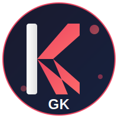

<p align="center">
  
</p>

<h1 align="center">KillerGK</h1>

<p align="center">
  <strong>A Modern C++ GUI Library Built on Vulkan</strong>
</p>

<p align="center">
  
  
  
  
</p>

---

## Overview

KillerGK is a comprehensive, high-performance C++ GUI library designed to compete with industry standards like WPF, JUCE, and Dear ImGui. Built on Vulkan for maximum performance on modern hardware, it provides a complete solution for building desktop applications with advanced animations, visual effects, and a developer-friendly Builder Pattern API.

## Features

### Core GUI System
- Custom window management with frameless and transparent window support
- Comprehensive widget system (Button, TextField, Label, Image, ComboBox, DataGrid, TreeView)
- Flexible layout engine (FlexBox, Grid, Absolute, Stack)
- Advanced animation system with spring physics and keyframe support
- Theme engine with Material Design, Flat, and Glassmorphism styles

### Specialized Modules
- **KGK2D** - 2D graphics, sprites, particles, and tilemaps
- **KGK3D** - 3D rendering, model loading, PBR materials, and skeletal animation
- **KGKAudio** - Audio playback, 3D spatial audio, and effects processing
- **KGKNet** - HTTP client, WebSocket, TCP/UDP sockets
- **KGKMedia** - Video playback, screenshot capture, image processing

### Technical Highlights
- Vulkan-based rendering with GPU acceleration
- Builder Pattern API for intuitive widget configuration
- Property-based testing for correctness verification
- Cross-platform support (Windows, Linux, macOS)

## Requirements

- C++20 compatible compiler
- CMake 3.20 or higher
- Vulkan SDK 1.3+
- GLFW 3.3+

## Building

```bash
# Clone the repository
git clone https://github.com/i87kxxz/KillerGK.git
cd KillerGK

# Create build directory
mkdir build && cd build

# Configure and build
cmake ..
cmake --build . --config Release
```

## Quick Start

```cpp
#include <KillerGK/KillerGK.hpp>

using namespace KGK;

int main() {
    auto app = Application::instance()
        .title("My Application")
        .size(1280, 720)
        .theme(Theme::material());
    
    auto window = Window::create()
        .title("Hello KillerGK")
        .size(800, 600)
        .child(
            Button::create()
                .text("Click Me")
                .variant(ButtonVariant::Primary)
                .onClick([]() {
                    std::cout << "Button clicked!" << std::endl;
                })
        );
    
    app.run();
    return 0;
}
```

## Project Structure

```
KillerGK/
├── include/KillerGK/     # Public headers
│   ├── core/             # Core types and utilities
│   ├── widgets/          # UI widgets
│   ├── layout/           # Layout system
│   ├── rendering/        # Vulkan rendering backend
│   ├── platform/         # Platform abstraction
│   ├── animation/        # Animation system
│   ├── theme/            # Theming engine
│   ├── kgk2d/            # 2D graphics module
│   ├── kgk3d/            # 3D graphics module
│   ├── kgkaudio/         # Audio module
│   ├── kgknet/           # Networking module
│   └── kgkmedia/         # Media module
├── src/                  # Implementation files
├── tests/                # Unit and property-based tests
├── examples/             # Example applications
├── external/             # Third-party dependencies
└── docs/                 # Documentation
```

## Documentation

Full API documentation and tutorials are available in the `docs/` directory.

## Testing

```bash
# Build and run tests
cmake --build build --target test_core_types
cmake --build build --target test_properties

# Run tests
./build/bin/Debug/test_core_types
./build/bin/Debug/test_properties
```

## License

This project is licensed under the MIT License - see the LICENSE file for details.

## Contributing

Contributions are welcome. Please read the contributing guidelines before submitting pull requests.

## Author

Developed by HolyByte Studio

---

<p align="center">
  <sub>Built with Vulkan for maximum performance</sub>
</p>
